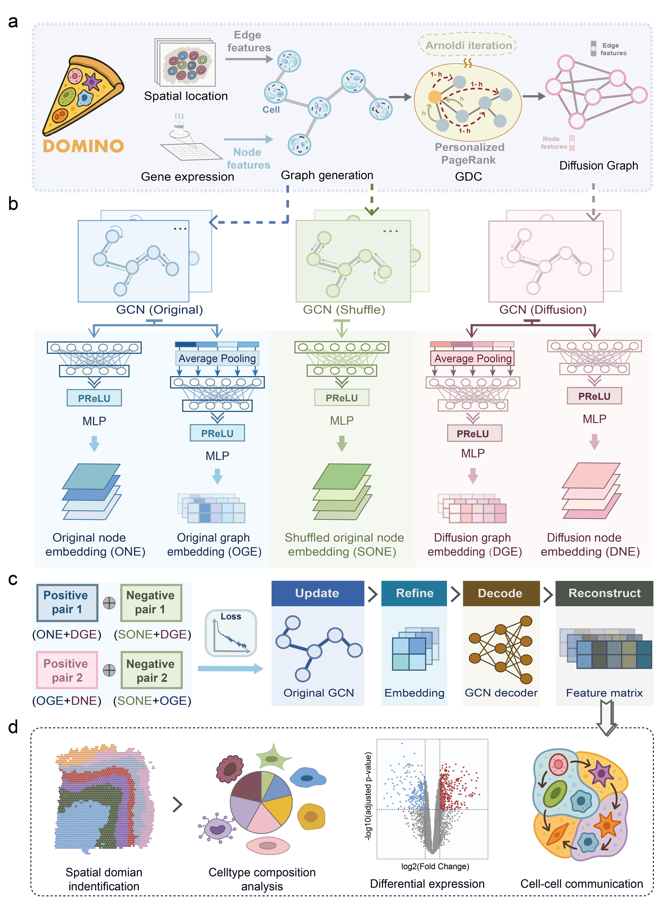

# DOMINO: diffusion-optimised graph learning identifies domain structures with enhanced accuracy and scalability



## Overview

DOMINO is built based on a self-supervised multi-view graph contrastive learning framework. It is designed to integrate spatial coordinates and gene expression information for robust identification of tissue domains from spatial transcriptomics (ST) data. DOMINO employs graph neural networks (GNNs) as base encoder, constructing a multi-view graph contrastive learning framework using the original graph and the diffusion graph to learn spot representations in the ST data. After representation learning, the learned low-dimensional embeddings can then be used to identify spatial domains, which can further be used in different downstream analyses, including cell type composition analysis, differential expression, and inference of cell–cell communication.

## Environment Requirements

To facilitate user access to the DOMINO model, we provide a Python package, `domino-spatial`. 
Before using the package, please configure the required environment by following the steps below

Environment Requirements

The package was developed and tested with:

- Python 3.8
- CUDA 11.6
- PyTorch 1.13.1
- torch_geometric 2.5.3

1. Install required Python packages
```
pip install -r requirement.txt
```

2. Install the correct versions of pyTorch and torch_geometrics:
```
pip install torch==1.13.1+cu116 -f https://download.pytorch.org/whl/cu116/torch_stable.html
pip install torch-geometric==2.5.3
```

3. Install `rpy2` (requires R >= 4.1.0)
```
conda install -c conda-forge r-base=4.1.0
conda install -c conda-forge rpy2
```

4. Configure the relevant environment variables:
Replace `<user_name>` and `<environment_name>` with your actual username and conda environment name.
```
export R_HOME=/home/<user_name>/anaconda3/envs/<environment_name>/lib/R
export R_LIBS_USER=/home/<user_name>/anaconda3/envs/<environment_name>/lib/R/library
```

5. Install `mclust` package:
```
conda install -c conda-forge r-mclust
```

## Tutorial

For the step-by-step tutorial, please refer to: https://domino-tutorials.readthedocs.io/en/latest/


## Quick Start: Running DOMINO with `domino_spatial.py`

For convenience, we provide a wrapper script `domino_spatial.py` that runs the full DOMINO workflow with a single command.

### 1. Project structure

Place your `.h5ad` file in a folder called `data` located in the same directory as `domino_spatial.py`:

```
project_folder/
│
├── domino_spatial.py
├── data/
│   └── your_file.h5ad
└── result/         # Auto-generated if missing
```

### 2. Run DOMINO
Inside the folder containing `domino_spatial.py`, run:

```
python domino_spatial.py --input your_file.h5ad --output_file domino_output.h5ad --n_clusters 7
```

DOMINO saves an updated AnnData object containing domain assignments in `./result/your_file_domino.h5ad`. DOMINO domain assigned are stored in: `adata.obs['domino']`. This column contains the DOMINO spatial domain label for each cell.

All default parameters used in the streamlined workflow can be overwritten; please refer to `domino_spatial.py` for available arguments and customisation options.
